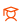
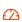
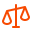
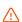

<h1 align="center">
  
   
  <b>SkinWatch</b>
</h1>

  Track, manage, and analyze your Counter-Strike skin investments with precision and ease.
   
  Real-time portfolio insights, profit tracking, and watchlist management — all in one place.

##  What is SkinWatch?
**SkinWatch** is a web application designed to help you track, manage, and analyze your Counter-Strike skin investments.  
Whether you're flipping custom crafts, selling knives, or holding long-term investments, SkinWatch provides real-time insight into your portfolio's performance.

---

##  Features

###  **Investment Tracking & Insights**
- Add and manage your Counter-Strike skin purchases and sales  
- Automatic profit/loss calculations using real-time pricing  
- Visualize portfolio growth over time  
- Know which items are moving with recent price changes  
- View recently added and sold items  

###  **Comprehensive Investment Actions**  
- Full control over investments (Edit Data, Add Notes, Mark Sold, Delete)  
- Record partial sales from multi-item purchases  
- Track remaining quantities & calculate realized/unrealized profits  
- Reverse sales back to original investment  
- Check current prices across marketplaces  

###  **Watchlist Items**  
- Keep an eye on items you’re interested in  
- Compare baseline vs. current prices from multiple markets  
- Filter and spot trending items  
- Set target prices you want to reach
- Edit, Reset, Switch Marketplace, Delete items

###  **Portfolio Health & Diversity**  
- Analyze asset allocation (knives, gloves, weapons, stickers, etc.)  
- Understand diversification, risk, and allocation through charts  

###  **Quick Actions** 
- Quick Check Market Prices  
- Quick Add Investment  
- Quick Record Sale   
- Quick Add Watchlist

###  **Beta Access via Invite Code**  
- Invite-only access using beta keys  
- Data stored securely and isolated per user  

###  **Performance-Oriented Design**  
- Clean, responsive UI  
- Debounced search, lazy loading, and optimized queries  

###  **Steam-Free & Privacy-First**  
- No Steam login or external linking  
- Fully disconnected from Steam/marketplaces  
- Your data stays private  

---

##  Tech Stack

- **Frontend:** React, TailwindCSS, Vite  
- **Backend:** Supabase (PostgreSQL, RLS, Functions)  
- **Authentication:** Custom Supabase Beta Key System  
- **APIs:** Skin price data (CSFloat, Buff, etc.)  
- **State Management:** React Context + custom hooks  

---

##  Roadmap

###  **Market Trends**  
- See trending skins, volume spikes, and insights  

###  **Craft Analysis**  
- Calculate worth of sticker crafts and combos  

###  **Learning**  
- Educational content to teach investing best practices  

###  **Pump Indicator**  
- Detect items starting to “pump” in price  

###  **Arbitrage**  
- Find marketplace underpriced items  

---

###  Disclaimer 
*All investment calculations, market insights, and recommendations provided by SkinWatch are based on custom algorithms and do not constitute financial advice. Always do your own research before investing.*